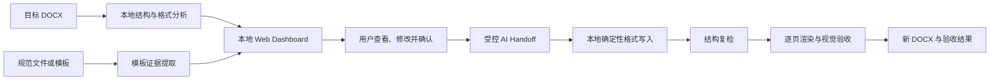

# Word Format Master

Word Format Master 是面向 Windows 10/11 的本地 Word/DOCX 格式分析、配置、应用与验收工具。项目以模板证据和显式格式规范为依据，在网页中查看目标文档的结构与格式设置、调整参数并预览效果；只有用户确认后，AI 才能通过受控交接调用本地脚本生成新的 DOCX。

项目重点处理毕业论文、学位论文和科研报告中的页面设置、正文、标题、多级编号、图表题注、目录、参考文献、页眉页脚与页码格式。源文档不会被覆盖。

运行环境：Windows 10/11，Python 3.10 及以上。建议安装 Microsoft Word；LibreOffice 可作为本地渲染后端。

## 核心能力

- **网页查看、修改与预览**：本地 Dashboard 展示页面、正文、标题、列表、题注、目录、参考文献、页眉页脚和验收设置。浏览器预览用于快速检查配置，不冒充 Word 的最终分页结果。
- **严格模板提取**：从 DOCX/DOTX 的样式、继承、直接格式、主题字体、分节、编号、字段和内容结构中提取有证据的格式值；模板未定义的值保持为空或关闭，不用内置预设补齐。
- **论文模块契约**：按封面、摘要、关键词、目录、正文各章、参考文献、致谢、附录等模块识别顺序和角色。模板提取、格式应用与结构验收共享同一套模块边界规则。
- **确认式 AI 交接**：Dashboard 必须通过 `--input` 和 `--output` 创建目标文档会话。用户点击“确认设置并交给 AI”后才生成带源文件指纹、输出路径、格式规范和具体写入方法的 `HANDOFF.json`。
- **AI 与本地脚本互证**：本地脚本负责可重复的 OOXML 解析、写入和结构校验；AI 只在受约束的语义分析、引用位置判断和视觉检查环节提供判断。分析任务使用领取令牌和租约，避免重复或过期结果覆盖当前任务。
- **结构与视觉双重验收**：输出文件先重新打开并检查样式、字段、目录、题注、引用和模块结构，再用用户选择的 Word 或 LibreOffice 渲染全部页面。渲染清单记录输出 DOCX 和每页 PNG 的 SHA-256，视觉报告必须与清单、渲染器和页数一致。
- **本地数据边界**：Dashboard 只监听 `127.0.0.1`，校验 Host 请求头，不向页面返回源 DOCX 内容，也不提供绕过确认流程的直接应用接口。除用户主动下载 LibreOffice 安装包外，程序不建立外部连接。

## 工作流程



格式写入不是网页直接下载流程。`/api/apply` 不存在，`apply_spec.py` 也拒绝独立规范和预设 ID；生成文档必须使用与当前源文件路径、输出路径和 SHA-256 相匹配的已确认 Handoff。

## 快速开始

```powershell
git clone https://github.com/xiaoyang732/word-format-master.git
Set-Location word-format-master
python -m pip install -r requirements.txt
python scripts/serve_dashboard.py --input .\paper.docx --output .\paper-formatted.docx
```

服务会在 `127.0.0.1` 上选择可用端口并打开 Dashboard。完成网页调整后，点击“确认设置并交给 AI”；AI 读取已确认的交接方案，调用其中登记的本地工具生成和验收输出文件。

仅需自动化检查而不打开浏览器时：

```powershell
python scripts/serve_dashboard.py --input .\paper.docx --output .\paper-formatted.docx --no-open
```

## 模板与格式边界

- 上传的 DOCX/DOTX 是完整格式证据，不与内置预设深度合并。
- 每个网页可编辑字段必须在 `scripts/apply_spec.py` 的 `SUPPORTED_APPLICATION_PATHS` 中登记对应的确定性写入方法。
- `document_structure` 保存模板中的模块顺序、段落范围和角色样式；应用阶段只修改相应模块的格式，不移动、补写或重写正文内容。
- 不支持旧版 `.doc`、宏启用的 DOCM/DOTM。旧版 `.doc` 应先在 Word 中转换为只读副本的 `.docx`。
- 浏览器预览只用于配置反馈。最终页数、分页、表格溢出、页眉页脚位置和字形显示以本地渲染结果为准。
- `python-docx` 能写入 TOC、REF、PAGEREF、PAGE 等字段，但不能计算字段结果；交付前仍应在 Word 中刷新字段。

## 程序结构

```text
word-format-master/
├── assets/
│   ├── presets.json               # 已审核的格式预设
│   └── ui/                        # Dashboard 静态界面
├── references/
│   ├── architecture.md            # 接口边界、模块职责与升级规则
│   ├── format-spec.md             # 格式规范数据契约
│   └── project-research.md        # 技术选型依据
├── scripts/
│   ├── analyze_docx.py            # DOCX/DOTX 包、样式和格式证据提取
│   ├── document_structure.py      # 论文模块识别、顺序与角色规则
│   ├── apply_spec.py              # 格式校验与确定性 OOXML 写入
│   ├── dashboard_session.py       # 会话、确认 Handoff 和验收回传
│   ├── serve_dashboard.py         # 本地 HTTP 接口与静态资源服务
│   ├── local_ai_analysis.py       # AI 分析任务领取和结果回传
│   ├── render_docx.py             # Word/LibreOffice 渲染与清单生成
│   ├── verify_output.py           # 结构和视觉报告校验
│   ├── validate_project.py        # 项目契约检查
│   └── smoke_test.py              # 端到端冒烟测试
├── SECURITY.md                    # 安全边界与剩余风险
├── SKILL.md                       # AI Agent 工作流规则
└── requirements.txt               # 固定版本依赖
```

接口和模块维护规则见 [references/architecture.md](references/architecture.md)。

## 上线前验证

```powershell
python scripts/validate_project.py
python scripts/smoke_test.py
python -m compileall -q scripts
node --check assets/ui/app.js
git diff --check
```

CI 在 `windows-latest` 上对 Python 3.10、3.11 和 3.12 运行项目校验与冒烟测试。发布前还应在装有 Microsoft Word 的 Windows 机器上，用真实长文档完成一次全页视觉验收。

## 已知限制

- LibreOffice 与 Microsoft Word 的分页和字段更新可能不同；选择指定渲染器时不会静默切换。
- LibreOffice 托管下载目前校验传输长度并保存本地 SHA-256，但尚未与官方独立发布的哈希或签名建立信任锚。
- 分析任务和 Dashboard 会话保存在内存中，服务重启后不会恢复。
- 当前测试以端到端冒烟测试和项目契约校验为主，仍应逐步增加独立单元测试和恶意输入测试。

## 开源协议

本项目使用 [MIT License](LICENSE)。
