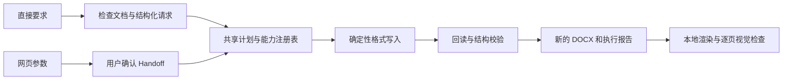

# Word Format Master

以确定性代码为核心的本地 Word 格式工具。支持两种使用方式：直接告诉 AI 修改要求，或在网页配置参数后交给 AI 执行。两种入口共享 `scripts/word_format/` 格式核心，生成新的 DOCX，保留源文档。

适用于论文、学位论文和科研报告的格式调整，也支持某章、某段和局部文字的精确修改。AI 负责理解要求并调用本地工具；格式引擎本身不调用大模型，也不操作网页。

## 安装

运行环境为 Windows 10/11、Python 3.10 及以上。格式修改和结构校验无需安装 Word；最终分页与视觉验收需要 Microsoft Word 或 LibreOffice。

```powershell
git clone https://github.com/xiaoyang732/word-format-master.git
Set-Location word-format-master
python -m venv .venv
.\.venv\Scripts\python.exe -m pip install -r requirements.txt
```

以下命令中的 `python` 应使用上述虚拟环境解释器，或其他已安装依赖的 Python。可在 PowerShell 中执行 `.\.venv\Scripts\Activate.ps1` 激活环境。

## 方式一：直接告诉 AI

在具备本地文件和命令执行能力的 AI 会话中，使用本项目的 [SKILL.md](SKILL.md)，提供文档路径、修改位置与格式要求，例如：

- “把这份文档的正文改为宋体、小四，其他格式保持。”
- “将第三章正文的段后距设为 6 磅。”
- “只把指定段落中的‘重要结论’改为 14 磅并加粗。”

AI 先检查当前文档，解析明确的目标，再生成计划、调用代码并回读验证。目标和参数明确时直接执行；文字重复、章节不唯一或要求冲突时需要澄清。直接模式无需启动网页或取得网页 Handoff。

### 直接 CLI 示例

先检查文档对象与格式能力：

```powershell
New-Item -ItemType Directory -Force .tmp/format | Out-Null
python scripts/format_cli.py capabilities --output .tmp/format/capabilities.json
python scripts/format_cli.py inspect .\paper.docx --output .tmp/format/inspect.json
```

确认检查结果中的正文范围后，创建请求。以下示例将识别为正文的段落字号设为 12 磅：

```powershell
@'
{
  "schema_version": "2.0",
  "origin": "direct",
  "operations": [
    {
      "action": "font.size.set",
      "target": {"type": "paragraph", "role": "body", "all": true},
      "params": {"value": 12, "unit": "pt"}
    }
  ]
}
'@ | Set-Content -Encoding utf8 .tmp/format/request.json

python scripts/format_cli.py plan .\paper.docx .\paper-formatted.docx --request .tmp/format/request.json --output .tmp/format/plan.json
python scripts/format_cli.py apply --plan .tmp/format/plan.json --report .tmp/format/report.json
python scripts/format_cli.py verify --plan .tmp/format/plan.json --report .tmp/format/report.json
```

段落和章节 ID 必须取自当前 `inspect` 结果。已有输出默认拒绝覆盖；显式传入 `apply --overwrite` 可替换输出，源文件始终不能作为输出。请求格式、选择器、单位和错误状态见 [直接格式 API](references/direct-format-api.md)。

## 方式二：网页配置后交给 AI

```powershell
python scripts/serve_dashboard.py --input .\paper.docx --output .\paper-formatted.docx
```

服务仅监听 `127.0.0.1`，自动选择可用端口并打开浏览器。用户调整参数后点击“确认设置并交给 AI”；AI 读取已确认的 `HANDOFF.json`，调用本地格式代码执行并验收。AI 不代替用户操作网页确认。

使用 `--no-open` 可禁止自动打开浏览器；使用 `--port 8765` 可指定端口。只运行 `python scripts/serve_dashboard.py` 可查看配置界面，但执行交接需要通过 `--input` 和 `--output` 创建目标文档会话。

网页可配置页面、正文、标题、列表、题注、目录、参考文献、表格、页眉页脚和页码，也支持从 DOCX/DOTX 模板提取格式。模板未定义的值不会由预设自动补齐。

## 格式核心与验收



每项格式在 `registry.py` 登记参数校验、执行 handler、读取方法和验收方法；原子属性由 `properties.py` 统一读写。网页旧规范由 `spec.py` 转换为相同操作。

| 类别 | 支持内容 |
|---|---|
| 字体 | 中文/西文字体、字号、粗体、斜体、颜色 |
| 段落 | 对齐、段前/段后距、行距、首行/悬挂/左右缩进、分页控制 |
| 页面与表格 | 所选节的页面尺寸、方向、边距；表格对齐、标题行重复、三线表 |
| 显式结构操作 | 编号、目录、题注、引用、页眉页脚、页码 |
| 修改范围 | 整篇选定角色、章节、段落、表格段落、文字范围、节、共享段落样式 |

单独修改字号只写入指定字号；目录、编号和引用转换需明确请求。计划绑定源文件 SHA-256 和对象指纹；保存到临时文件后回读校验，通过后才发布输出，失败不发布半成品。具体边界见 [安全说明](SECURITY.md)。

结构校验通过不代表视觉验收通过。最终分页、字形、表格溢出、目录和页眉页脚位置需要用 `scripts/render_docx.py` 渲染并检查全部页面；缺少这一步时应报告视觉验收未完成。

## 仓库结构

```text
word-format-master/
├── .github/workflows/ci.yml   # Windows 自动化验证
├── agents/openai.yaml        # AI 技能入口配置
├── assets/
│   ├── presets.json          # 格式预设
│   └── ui/                   # Dashboard 页面、脚本与样式
├── references/               # API、规范、架构、技术依据与标准说明
├── scripts/
│   ├── format_cli.py         # 直接调用入口
│   ├── word_format/          # 共享核心：检查、选择、计划、写入、验收
│   ├── apply_spec.py         # 网页 Handoff 适配与结构操作
│   ├── serve_dashboard.py    # 本地网页服务
│   ├── analyze_docx.py       # 文档/模板格式提取
│   ├── document_structure.py # 模块和段落角色识别
│   ├── render_docx.py        # Word/LibreOffice 渲染
│   ├── verify_output.py      # 结构与视觉报告校验
│   └── ...                   # 会话、引用、运行环境与测试工具
├── tests/                    # 格式核心单测和网页回归测试
├── SKILL.md                  # AI 工作流
├── SECURITY.md               # 安全边界与剩余风险
├── requirements.txt          # Python 依赖
└── LICENSE                   # MIT
```

运行生成的 `.runtime/`、开发产物 `.tmp/`、Python 缓存和虚拟环境由 Git 忽略。测试截图保存到 `.tmp/dashboard-ui/`，生产文档和执行报告建议保存在仓库之外。

维护资料：[架构](references/architecture.md) · [直接 API](references/direct-format-api.md) · [格式规范](references/format-spec.md) · [技术依据](references/project-research.md) · [标准与预设](references/standards-registry.md)。

## 开发验证

```powershell
python -B scripts/validate_project.py
python -B scripts/smoke_test.py
python -B -m unittest discover -s tests -v
node --check assets/ui/app.js
git diff --check
```

CI 在 `windows-latest` 上验证 Python 3.10、3.11、3.12、3.13 和 3.14，执行项目契约校验、DOCX smoke 和格式核心单测。

网页回归测试另需 Node.js、Playwright 和 Microsoft Edge。安装开发依赖并在另一个终端启动无文档的测试 Dashboard：

```powershell
npm install --no-save --package-lock=false playwright
python -B scripts/serve_dashboard.py --no-open --port 8765
```

在测试终端执行：

```powershell
node tests/test_dashboard_ui.cjs http://127.0.0.1:8765/
```

测试默认使用 Edge，也可通过 `WFM_BROWSER_CHANNEL` 指定 Playwright 浏览器通道。UI 测试和真实文档全页视觉验收目前不在 CI 中自动执行。

## 已知限制

- 旧版 `.doc` 需先转换为 `.docx`；DOCM/DOTM 和 Strict OOXML 写入不支持。
- 局部文字支持可确定映射的普通文字与超链接 run；含复杂域、绘图、制表符、换行或修订的范围会拒绝。按页定位和新建分节尚不支持。
- TOC、REF、PAGEREF、PAGE 等字段可写入，但 `python-docx` 无法计算字段结果；交付前需在 Word 或支持的渲染器中刷新。
- 浏览器预览仅用于配置反馈。Word 与 LibreOffice 的分页和字段结果可能不同；指定渲染器时不会静默切换。
- Dashboard 会话和分析任务不在服务重启后恢复。LibreOffice 托管下载的独立官方哈希/签名验证仍待增强。

## 开源协议

[MIT License](LICENSE)。
